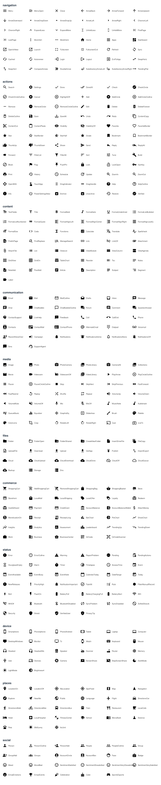

<!--
  GENERATED FILE -- DO NOT EDIT BY HAND.
  Source of truth: meta/builtin-icons.json
  Regenerate with: npm run icons:builtin
-->

# Built-in icons

wiremark ships 403 built-in icons -- the filled (baseline) style of Google's
Material Icons, the set behind `@mui/icons-material`. Use them anywhere an element
takes an icon prop:

```wireframe
Wireframe #home
  Button "Save" startIcon=Check
  Icon Search
```

Names are written in MUI PascalCase (`ArrowBack`), but lookup is forgiving:
`ArrowBack`, `arrow-back`, `arrow_back`, and `arrowback` all resolve to the same
icon. An unknown name renders the placeholder glyph and a soft warning -- never
an error. Custom icons can be added per document or per host; see the
[icons guide](../guides/09-icons.md).



## navigation

`Menu` `MenuOpen` `Close` `ArrowBack` `ArrowForward` `ArrowUpward` `ArrowDownward` `ArrowDropDown` `ArrowDropUp` `ArrowLeft` `ArrowRight` `ChevronLeft` `ChevronRight` `ExpandLess` `ExpandMore` `UnfoldLess` `UnfoldMore` `FirstPage` `LastPage` `MoreVert` `MoreHoriz` `Home` `Apps` `Dashboard` `OpenInNew` `Launch` `Fullscreen` `FullscreenExit` `Refresh` `Sync` `Cached` `Autorenew` `Login` `Logout` `ExitToApp` `SwapHoriz` `SwapVert` `CompareArrows` `DoubleArrow` `SubdirectoryArrowLeft` `SubdirectoryArrowRight` `TrendingFlat`

## actions

`Search` `Settings` `Done` `DoneAll` `Check` `CheckCircle` `CheckCircleOutline` `Cancel` `HighlightOff` `Add` `AddCircle` `AddCircleOutline` `Remove` `RemoveCircle` `RemoveCircleOutline` `Edit` `Delete` `DeleteForever` `DeleteOutline` `Save` `SaveAlt` `Undo` `Redo` `ContentCopy` `ContentCut` `ContentPaste` `Visibility` `VisibilityOff` `Favorite` `FavoriteBorder` `Star` `StarBorder` `StarHalf` `Grade` `Bookmark` `BookmarkBorder` `ThumbUp` `ThumbDown` `Share` `Send` `Reply` `ReplyAll` `Forward` `FilterList` `FilterAlt` `Sort` `Tune` `Build` `Block` `Flag` `PushPin` `Lock` `LockOpen` `VpnKey` `Print` `History` `Schedule` `Update` `ZoomIn` `ZoomOut` `OpenWith` `TouchApp` `DragIndicator` `DragHandle` `Help` `HelpOutline` `Info` `PowerSettingsNew` `Archive` `Unarchive` `Restore` `Verified`

## content

`TextFields` `Title` `FormatBold` `FormatItalic` `FormatUnderlined` `FormatListBulleted` `FormatListNumbered` `FormatQuote` `FormatAlignLeft` `FormatAlignCenter` `FormatAlignRight` `FormatAlignJustify` `FormatSize` `Code` `Functions` `Calculate` `Translate` `Spellcheck` `FindInPage` `FindReplace` `ManageSearch` `Link` `LinkOff` `Attachment` `AttachFile` `List` `ViewList` `ViewModule` `ViewColumn` `ViewAgenda` `GridView` `GridOn` `TableChart` `Reorder` `Toc` `Notes` `NoteAdd` `PostAdd` `Article` `Description` `Subject` `Segment` `Label`

## communication

`Email` `Mail` `MailOutline` `Drafts` `Inbox` `Message` `Chat` `ChatBubble` `ChatBubbleOutline` `Forum` `Comment` `QuestionAnswer` `ContactSupport` `LiveHelp` `Feedback` `Call` `CallEnd` `Phone` `Contacts` `ContactMail` `ContactPhone` `AlternateEmail` `Dialpad` `Voicemail` `RecordVoiceOver` `Campaign` `Notifications` `NotificationsActive` `NotificationsNone` `NotificationsOff` `Sms` `SupportAgent`

## media

`Image` `Photo` `PhotoCamera` `PhotoLibrary` `CameraAlt` `Collections` `Movie` `Videocam` `VideocamOff` `VideoLibrary` `PlayArrow` `PlayCircleOutline` `Pause` `PauseCircleOutline` `Stop` `SkipNext` `SkipPrevious` `FastForward` `FastRewind` `Replay` `Shuffle` `Repeat` `VolumeUp` `VolumeDown` `VolumeMute` `VolumeOff` `Mic` `MicOff` `MusicNote` `Audiotrack` `QueueMusic` `Equalizer` `GraphicEq` `Slideshow` `Brush` `Palette` `ColorLens` `Crop` `RotateLeft` `RotateRight` `Cast` `LiveTv`

## files

`Folder` `FolderOpen` `FolderShared` `CreateNewFolder` `InsertDriveFile` `FileCopy` `UploadFile` `Download` `Upload` `GetApp` `Publish` `ImportExport` `Cloud` `CloudUpload` `CloudDownload` `CloudDone` `CloudOff` `CloudQueue` `Backup` `Storage` `Dns`

## commerce

`ShoppingCart` `AddShoppingCart` `RemoveShoppingCart` `ShoppingBag` `ShoppingBasket` `Store` `Storefront` `LocalMall` `LocalShipping` `LocalOffer` `Loyalty` `Redeem` `CardGiftcard` `Payment` `CreditCard` `AccountBalance` `AccountBalanceWallet` `AttachMoney` `MonetizationOn` `Receipt` `ReceiptLong` `BarChart` `PieChart` `ShowChart` `Insights` `Analytics` `Assessment` `Leaderboard` `TrendingUp` `TrendingDown` `Work` `Business` `BusinessCenter` `QrCode` `QrCodeScanner`

## status

`Error` `ErrorOutline` `Warning` `ReportProblem` `Pending` `PendingActions` `HourglassEmpty` `Alarm` `Timer` `Timelapse` `AccessTime` `Event` `EventAvailable` `EventBusy` `EventNote` `CalendarToday` `DateRange` `Today` `NewReleases` `PriorityHigh` `NotificationImportant` `TaskAlt` `Rule` `FiberManualRecord` `Bolt` `FlashOn` `BatteryFull` `BatteryChargingFull` `BatteryAlert` `Wifi` `WifiOff` `Bluetooth` `BluetoothDisabled` `SyncProblem` `SyncDisabled` `DoNotDisturb` `Security` `Shield` `VerifiedUser` `PrivacyTip`

## device

`Smartphone` `PhoneIphone` `PhoneAndroid` `Tablet` `Laptop` `Computer` `DesktopWindows` `Monitor` `Tv` `Watch` `Keyboard` `Mouse` `Headset` `HeadsetMic` `Speaker` `Scanner` `Router` `Memory` `Usb` `Devices` `Camera` `ScreenShare` `StopScreenShare` `DarkMode` `LightMode` `Brightness4`

## places

`LocationOn` `LocationOff` `MyLocation` `GpsFixed` `Map` `Navigation` `Explore` `NearMe` `Public` `Language` `Flight` `DirectionsCar` `DirectionsWalk` `DirectionsBike` `DirectionsBus` `Train` `Restaurant` `LocalCafe` `Hotel` `LocalHospital` `FitnessCenter` `School` `MenuBook` `Science` `Pets` `WbSunny` `AcUnit`

## social

`Person` `PersonOutline` `PersonAdd` `People` `PeopleOutline` `Group` `GroupAdd` `Groups` `AccountCircle` `AccountBox` `Face` `Badge` `Mood` `MoodBad` `SentimentSatisfied` `SentimentDissatisfied` `SentimentVeryDissatisfied` `SentimentVerySatisfied` `EmojiEmotions` `EmojiEvents` `Celebration` `Cake` `SportsEsports`
